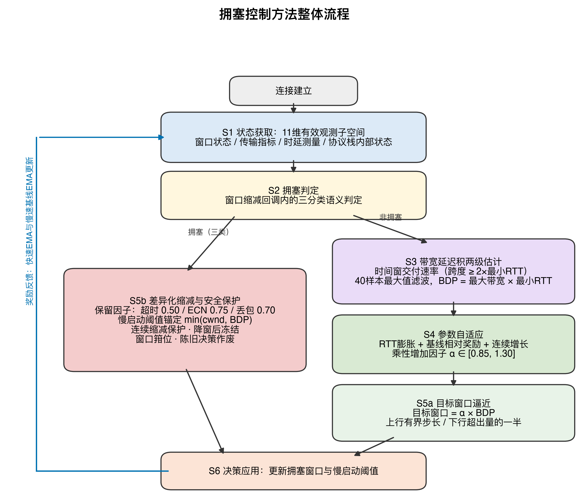
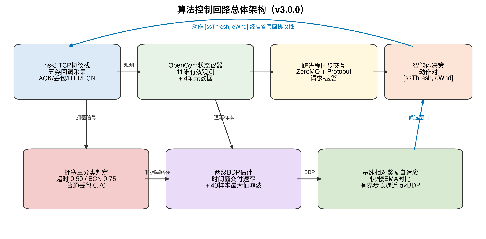

# 发明专利申请

---

## 一种多信号融合与强化学习辅助的自适应网络拥塞控制方法及系统

---

### 技术领域

[0001] 本发明涉及计算机网络技术领域，特别涉及一种多信号融合与强化学习辅助的自适应网络拥塞控制方法及系统，可应用于远距离传输、多种接入方式以及异构终端并存的端到端网络传输场景。

---

### 背景技术

[0002] 随着云计算、移动互联网、人工智能和物联网技术的快速发展，端到端网络传输场景正在从单一固定终端和近端高质量链路，扩展到跨地域远距离传输、蜂窝网络、无线局域网、卫星网络以及手机、笔记本电脑、台式机、边缘设备等多种终端并存的复杂环境。传输控制协议（Transmission Control Protocol，TCP）作为互联网传输层的核心协议，其拥塞控制机制直接影响网络资源利用效率、应用响应延迟和用户服务质量。在远距离路径、高带宽延迟积链路、无线链路抖动以及终端能力差异并存的场景下，拥塞控制算法面临更加复杂的信号感知和参数适配问题。

[0003] 在上述端到端传输环境中，拥塞信号的语义显著变得更加模糊。丢包既可能来自瓶颈队列真实溢出，也可能来自无线误码、链路切换或发送端调度抖动；往返时延（Round-Trip Time，RTT）升高既可能表示瓶颈排队，也可能来自路径变化、接入链路波动或对端处理延迟；终端后台同步、突发业务和多租户共享链路还会造成短时带宽挤占。依赖单一信号的拥塞控制方法难以在这些条件下稳定区分拥塞的成因与严重程度。

[0004] 现有的 TCP 拥塞控制算法主要分为两大类别：基于丢包的拥塞控制算法和基于延迟的拥塞控制算法。这两类算法各有优缺点，但都难以完全适应远距离、多接入和异构终端并存的现代端到端传输需求。

[0005] 基于丢包的拥塞控制算法（如 TCP NewReno、TCP CUBIC、TCP Reno 等）将数据包丢失作为网络拥塞的主要判断信号。此类算法在无丢包时按固定规律增加拥塞窗口，在检测到丢包时按固定比例缩减窗口。这类算法实现简单、鲁棒性强、与现有网络基础设施兼容性好，但存在以下固有缺陷：

[0006] 第一，丢包是拥塞的滞后信号。网络设备缓冲区在溢出丢包之前已经积累了排队数据，传输延迟已经显著增加，对交互式应用、移动业务和边缘服务等延迟敏感型业务影响明显。

[0007] 第二，在高带宽延迟积（Bandwidth-Delay Product，BDP）链路上收敛速度较慢。远距离传输、卫星链路、跨域广域网和高速无线接入均可能形成较大的带宽延迟积；窗口因丢包或超时回退后，需要较长时间才能恢复到充分利用链路容量的状态。

[0008] 第三，缺乏对拥塞程度的精细感知能力。此类算法仅能区分"有丢包"与"无丢包"两种状态，无法区分轻度拥塞与严重拥塞，因而对不同严重程度的拥塞事件采用统一的窗口缩减比例，在轻度拥塞时造成不必要的吞吐损失，在严重拥塞时又响应不足。

[0009] 基于延迟的拥塞控制算法（如 TCP Vegas、TCP BBR 等）通过监测 RTT 变化或显式估计瓶颈带宽与最小 RTT 来推断拥塞状态，试图在丢包发生前感知拥塞。此类算法通常能够获得较低的排队延迟，但也存在明显不足：

[0010] 第一，RTT 测量易受操作系统调度延迟、路径抖动、拓扑变化和对端处理延迟等因素干扰；在高速链路上这些干扰量可能与真实排队延迟处于同一数量级，使基于 RTT 的拥塞推断不可靠。

[0011] 第二，与基于丢包的算法共存时存在带宽分配失衡问题。基于延迟的算法在 RTT 升高时提前降速，而基于丢包的算法继续增窗直至丢包，导致不同拥塞控制范式共存时公平性下降。

[0012] 第三，对突发流量和路径变化的适应性有限。此类算法的控制参数通常为预设固定值，难以随终端类型、接入方式和路径 RTT 的变化自适应调整。

[0013] 此外，现有基于速率的带宽估计方法多采用"单次确认所携带字节数除以一个完整 RTT"的瞬时公式。该公式在一个 RTT 内存在多个确认事件时会将真实带宽低估至约为其真实值除以每 RTT 确认次数的水平，在高带宽延迟积的远距离路径上尤为严重，导致带宽延迟积估计塌缩、目标窗口被限制在保守下界附近，进而限制链路利用率。

[0014] 显式拥塞通知（Explicit Congestion Notification，ECN）机制允许网络设备在队列长度超过预设阈值时，在 IP 报头中设置拥塞经历（Congestion Experienced，CE）标记而非直接丢弃数据包；接收端通过 TCP 报头的 ECN-Echo（ECE）标志将拥塞信息反馈给发送端。ECN 能够在丢包发生前提供明确的拥塞信号，避免重传开销，且来自网络设备的显式标记比推测性的 RTT 测量更为可靠。

[0015] 然而，现有拥塞控制算法对 ECN 的利用仍不充分。多数算法将 ECN 视为等同于丢包的信号，采用相同的窗口缩减比例；作为现有技术的数据中心 TCP（DCTCP）虽然利用 ECN 标记比例进行细粒度调整，但其控制参数为静态预设，且以低时延、同质化链路为适用前提，在路径 RTT 跨越数量级、终端类型多样的端到端环境中缺乏自适应能力。

[0016] 近年来，强化学习（Reinforcement Learning，RL）为拥塞控制提供了新的技术路径。强化学习通过"观测—动作—奖励"的交互闭环持续优化决策策略，理论上能够综合利用多种拥塞信号并动态调整控制参数。然而现有基于强化学习的拥塞控制方案仍存在以下问题：

[0017] 第一，状态空间设计不完善。现有方案通常仅使用有限的窗口与时延参数，未将协议栈内部状态（特别是 ECN 协商与标记状态、拥塞避免状态机状态和拥塞事件类型）纳入决策输入，因而无法区分丢包与队列排队、无线损伤与真实溢出等不同成因。

[0018] 第二，参数自适应机制不可靠。现有方案多以固定的绝对阈值判断奖励优劣；当奖励在绝大多数确认事件上均为正值时，绝对阈值判定会退化为单向棘轮，使控制参数持续朝上界漂移而丧失反馈意义。

[0019] 第三，缺乏对不确定拥塞信号的分级响应与安全约束。现有方案未对不同严重程度的拥塞信号施加差异化窗口缩减比例，也缺少防止窗口连续过度收缩、防止陈旧决策覆盖丢包恢复过程的保护机制，在链路条件波动或存在突发非响应式跨流量时容易出现窗口振荡或死锁式收缩。

[0020] 因此，需要一种新的技术方案：能够在协议栈回调点采集包含协议栈内部状态的多维拥塞状态信息，对拥塞成因与严重程度进行语义区分并施加差异化响应，采用不受确认事件密度影响的带宽延迟积估计方法，并以相对基线的奖励反馈实现控制参数在线自适应，从而提升远距离传输、多接入链路和异构终端并存环境下的传输稳定性与鲁棒性。

---

### 发明内容

[0021] 本发明的目的在于提供一种多信号融合与强化学习辅助的自适应网络拥塞控制方法及系统，以解决现有技术中拥塞状态信息利用不充分、拥塞成因无法语义区分、带宽延迟积估计在高带宽延迟积路径上塌缩、控制参数自适应机制退化为单向漂移，以及不确定拥塞信号下缺乏稳定性与安全保护等问题。

[0022] 为实现上述目的，本发明第一方面提供一种拥塞控制方法，应用于端到端网络传输的发送端，包括以下步骤：

[0023] S1、状态获取：在传输层协议栈的多个拥塞控制回调点采集拥塞状态信息，构成 11 维有效观测子空间，并将该有效观测子空间与用于跨模块路由的元数据一并承载于统一的状态传输容器中；

[0024] S2、拥塞判定：基于所述观测子空间中的回调类型标识、拥塞避免状态机状态与显式拥塞通知状态，在协议栈的窗口缩减回调内对拥塞事件进行三分类语义判定，分别判定为超时类拥塞、显式拥塞通知类拥塞或普通丢包类拥塞；在窗口增长回调内，当显式拥塞通知状态指示拥塞时判定为显式拥塞通知类拥塞；其余情况判定为非拥塞状态；

[0025] S3、带宽延迟积估计：分两级估计瓶颈链路的带宽延迟积，第一级在滑动时间窗内以累计已确认字节数的增量计算交付速率样本，所述滑动时间窗的跨度不小于最小往返时延的两倍；第二级对所述交付速率样本施加窗口化最大值滤波，并将滤波结果与最小往返时延相乘得到带宽延迟积估计值；

[0026] S4、参数自适应：为每个连接独立维护乘性增加因子，并依据往返时延膨胀比相对于最小往返时延感知阈值的判定结果、环境奖励相对于其自身慢速基线的判定结果以及连续增长趋势三个因子在线调整所述乘性增加因子，并将其箝位于预设的下界与上界之间；

[0027] S5、窗口决策：在拥塞状态下按拥塞类型选取差异化窗口保留因子对拥塞窗口执行乘性缩减，将慢启动阈值锚定于当前拥塞窗口与带宽延迟积估计值中的较小者，并施加连续缩减保护与降窗后冻结；在非拥塞状态下以所述乘性增加因子与带宽延迟积估计值之积作为目标窗口，以有界步长向上逼近目标窗口、以超出量的一半向下回落；最后将拥塞窗口箝位于预设的下界与上界之间；

[0028] S6、决策应用：将新的慢启动阈值与新的拥塞窗口作为动作输出并更新连接的传输控制参数；在只读的窗口缩减回调中无法直接写入拥塞窗口时，将拥塞窗口决策暂存并在后续可写的窗口增长回调中应用；当协议栈进入丢失状态时作废尚未应用的拥塞窗口决策。

[0029] 进一步地，所述步骤 S1 中，所述 11 维有效观测子空间包括：慢启动阈值、拥塞窗口、报文段大小、已确认报文段数量、在途字节数、最近往返时延、最小往返时延、回调类型标识、拥塞避免状态机状态、拥塞事件类型和显式拥塞通知状态；所述用于跨模块路由的元数据包括套接字标识符、环境类型标识、时刻信息和节点标识符共四项，与所述 11 维有效观测子空间共同构成 15 元素的状态传输容器。其中，所述回调类型标识用于区分该次观测由窗口缩减回调触发还是由窗口增长回调触发；所述拥塞避免状态机状态包括开放状态、无序状态、拥塞窗口缩减状态、恢复状态和丢失状态；所述拥塞事件类型包括传输开始、窗口重启、拥塞窗口缩减完成、丢包事件、无 CE 标记事件和有 CE 标记事件；所述显式拥塞通知状态包括禁用、空闲、收到 CE 标记、发送 ECE、收到 ECE 和发送 CWR。

[0030] 进一步地，所述步骤 S1 中的采集在下列回调点执行：窗口缩减回调，用于在协议栈请求新的慢启动阈值时采集状态并触发拥塞判定；窗口增长回调，用于在确认事件到达时采集状态并触发窗口增长决策；确认报文处理回调，用于更新最近往返时延与已确认报文段数量；拥塞状态设置回调，用于跟踪拥塞避免状态机状态的迁移；拥塞窗口事件回调，用于跟踪显式拥塞通知事件并维护拥塞标记检测标志。

[0031] 进一步地，所述步骤 S2 中的三分类语义判定按以下优先级执行：当拥塞避免状态机状态为丢失状态时，判定为超时类拥塞；否则，当显式拥塞通知状态为收到 CE 标记或收到 ECE，或者拥塞避免状态机状态已进入拥塞窗口缩减状态时，判定为显式拥塞通知类拥塞；其余情况判定为普通丢包类拥塞。所述判定不将单次 ECN 回显、恢复状态和往返时延膨胀本身作为独立的拥塞触发条件，以避免对瞬态网络扰动的过度响应。

[0032] 进一步地，所述步骤 S5 中的差异化窗口保留因子满足：超时类拥塞对应的保留因子小于普通丢包类拥塞对应的保留因子，普通丢包类拥塞对应的保留因子小于显式拥塞通知类拥塞对应的保留因子；缩减后的拥塞窗口不低于预设的窗口下界。作为优选，普通丢包类拥塞的保留因子取 0.70，显式拥塞通知类拥塞的保留因子取 0.75，超时类拥塞的保留因子取 0.50。

[0033] 进一步地，所述步骤 S3 中的带宽延迟积估计具体包括：

维护累计已确认字节数，并在每次确认事件到达时记录由时刻与累计已确认字节数构成的样本；

将滑动时间窗的跨度取为最小往返时延的两倍，并将其箝位于预设的时间下界与时间上界之间，逐出早于该时间窗的样本；

以时间窗内累计已确认字节数的增量除以该时间窗的实际跨度，得到一个交付速率样本；

维护容量为预设长度的交付速率样本队列，取队列内最大值作为瓶颈带宽估计值；

维护往返时延采样队列并跟踪全局最小往返时延，所述全局最小往返时延取历史采样与协议栈提供的最小往返时延观测值中的最小者；

将瓶颈带宽估计值与所述全局最小往返时延相乘得到带宽延迟积估计值；当该估计值不可用时，以当前拥塞窗口作为保守回退值。

作为优选，所述时间下界为 5 毫秒，所述时间上界为 1 秒，所述交付速率样本队列的容量为 40。

[0034] 进一步地，所述步骤 S4 中的三个因子具体包括：

因子一，路径感知的往返时延膨胀判定。以最小往返时延为依据构造松弛量，所述松弛量随最小往返时延的平方根增长；以该松弛量构造低、中、高三级动态阈值；当往返时延膨胀比低于低阈值时增大乘性增加因子并递增连续增长计数器，处于低阈值与中阈值之间时小幅增大乘性增加因子，高于高阈值时减小乘性增加因子并清零连续增长计数器。由于松弛量随最小往返时延增长，远距离长时延路径上的常规传播抖动不会被误判为瓶颈排队而抑制窗口。

因子二，相对基线的奖励判定。对环境奖励序列同时维护快速指数移动平均与慢速基线指数移动平均，并由所述慢速基线的幅值构造自适应裕度；当快速指数移动平均高于慢速基线加上所述裕度时增大乘性增加因子，当快速指数移动平均低于慢速基线减去所述裕度的预设倍数时减小乘性增加因子。由于每次确认事件产生的奖励几乎恒为正值，采用绝对阈值判定会退化为单向棘轮，故此处仅以奖励相对于自身基线的变化量作为有效反馈。

因子三，连续增长稳定性奖励。当连续增长计数器超过预设次数时，进一步小幅增大乘性增加因子。

作为优选，所述乘性增加因子的取值范围为 $[0.85, 1.30]$，初始值为 1.10。

[0035] 进一步地，所述步骤 S5 中，非拥塞状态下的窗口决策包括：

以乘性增加因子与带宽延迟积估计值之积作为目标窗口；

当当前拥塞窗口低于目标窗口时，按有界步长向上逼近，所述有界步长取加性调节量、一个报文段大小以及当前窗口与目标窗口之差的预设分数三者中的最大值，且逼近结果不超过目标窗口与加性调节量之和；

当当前拥塞窗口高于目标窗口时，按超出量的一半向下回落，且不低于目标窗口，以促使瓶颈队列排空；

当当前拥塞窗口与目标窗口相等时，按加性调节量执行保守增长；

慢启动阶段以带宽延迟积估计值的预设倍数与报文段大小的预设倍数中的较大者作为目标窗口，并在往返时延未出现明显膨胀且当前窗口显著低于带宽延迟积时采用加速增长；慢启动的退出判定采用随最小往返时延增大而放宽的往返时延膨胀容限，以避免远距离长时延路径在首次填充带宽延迟积的过程中过早退出慢启动。

[0036] 进一步地，所述步骤 S5 中的连续缩减保护与降窗后冻结包括：每次执行拥塞响应时递增连续缩减计数器并清零连续增长计数器；当连续缩减计数器超过预设的最大连续缩减次数时，保持当前拥塞窗口不再继续缩减；每次显式降窗后设置冻结计数器，在随后预设数量的确认事件内保持拥塞窗口不变以使瓶颈队列排空；所述连续缩减计数器仅在冻结结束且拥塞窗口实际进入增长分支时清零。作为优选，所述最大连续缩减次数为 3，所述冻结的确认事件数量为 4。

[0037] 进一步地，所述步骤 S5 中的慢启动阈值锚定包括：取当前拥塞窗口与带宽延迟积估计值中的较小者作为参考量，将该参考量与所述差异化窗口保留因子之积作为新的慢启动阈值，并使新的慢启动阈值不低于新的拥塞窗口且不低于预设的窗口下界。由于参考量不超过带宽延迟积估计值，队列膨胀所抬高的当前窗口不会被写入慢启动阈值，从而避免奖励队列膨胀。

[0038] 进一步地，所述步骤 S5 中的窗口箝位包括：将新的拥塞窗口的下界取为四个最大报文段长度，将新的拥塞窗口的上界取为带宽延迟积估计值的四倍与二百个最大报文段长度中的较大者；新的慢启动阈值同样不低于所述下界。所述上界用于在带宽估计陈旧或队列膨胀时抑制窗口失控增长，所述下界用于避免窗口收缩至无法维持传输的水平。

[0039] 进一步地，所述步骤 S6 中的决策应用包括：在只读的窗口缩减回调中，将拥塞窗口决策写入待应用缓冲并置位待应用标志；在后续的窗口增长回调中检测所述待应用标志，若已置位则将缓冲值应用于连接状态并复位标志；在拥塞状态设置回调中，当协议栈迁移至丢失状态时清除所述待应用标志并丢弃缓冲值，使超时重传前产生的陈旧窗口决策不会覆盖协议栈的丢包恢复过程。

[0040] 进一步地，所述方法还包括环境奖励的生成：在确认事件对应的窗口增长回调中，奖励由与已确认报文段数量成正比且设有上限的吞吐激励减去往返时延惩罚构成，所述往返时延惩罚仅在往返时延膨胀比超过预设阈值时生效并设有上限；在窗口缩减回调中，按拥塞类型施加分级负奖励，显式拥塞通知类拥塞的惩罚幅度小于普通丢包类拥塞，普通丢包类拥塞的惩罚幅度小于超时类拥塞。

[0041] 进一步地，所述方法为每个连接以套接字标识符为键独立维护状态数据结构，所述状态数据结构包括交付速率样本队列与队列内最大带宽值、确认样本队列与累计已确认字节数、往返时延采样队列与全局最小往返时延、带宽延迟积估计值、乘性增加因子、连续缩减计数器、连续增长计数器、降窗后冻结计数器、累计丢包计数、累计显式拥塞通知计数以及慢启动阶段标识，从而在多连接并发时实现状态隔离与差异化控制。

[0042] 本发明第二方面提供一种拥塞控制系统，包括：状态采集模块，用于在传输层协议栈的多个拥塞控制回调点采集所述 11 维有效观测子空间并组织为状态传输容器，同时跟踪显式拥塞通知事件；决策模块，用于执行拥塞三分类语义判定、带宽延迟积两级估计、乘性增加因子在线自适应以及目标窗口与差异化缩减的计算，输出新的慢启动阈值与新的拥塞窗口；决策应用模块，用于将所述输出应用于连接的传输控制参数，实现延迟窗口应用与陈旧决策作废；通信模块，用于在所述状态采集模块与所述决策模块位于不同进程时按请求—应答方式同步传递状态传输容器与动作向量。

[0043] 进一步地，所述状态采集模块包括：观测空间定义单元，用于定义所述状态传输容器的元素数量、数据类型与取值范围；状态采集单元，用于在窗口缩减回调、窗口增长回调、确认报文处理回调、拥塞状态设置回调和拥塞窗口事件回调采集状态参数；显式拥塞通知事件处理单元，用于在拥塞窗口事件回调中根据有 CE 标记事件置位拥塞标记检测标志、根据无 CE 标记事件清除该标志，并在窗口缩减回调中消费该标志；延迟窗口应用单元，用于在只读回调中缓存拥塞窗口决策并在后续可写回调中应用；陈旧决策作废单元，用于在协议栈进入丢失状态时丢弃尚未应用的拥塞窗口决策。

[0044] 本发明第三方面提供一种计算机可读存储介质，其上存储有计算机程序，所述计算机程序被处理器执行时实现上述方法的步骤。

[0045] 本发明第四方面提供一种电子设备，包括处理器和存储器，所述存储器用于存储计算机程序，所述处理器执行所述计算机程序时实现上述方法的步骤。

[0046] 本发明的有益效果包括：

第一，通过在协议栈回调点将 ECN 协商与标记状态、拥塞避免状态机状态和拥塞事件类型等协议栈内部状态纳入决策输入，本发明所述方法能够区分仅依赖丢包信号或仅依赖往返时延信号的方法所无法区分的拥塞成因，降低了对瞬态扰动的误判，缩短了拥塞响应的滞后。

第二，通过采用不小于两倍最小往返时延的滑动时间窗计算交付速率并对样本施加窗口化最大值滤波，本发明所述方法避免了瞬时公式在一个往返时延内存在多个确认事件时对带宽的系统性低估，使带宽延迟积估计在高带宽延迟积的远距离路径上保持有效，提升了对长距离传输的适应能力；同时最大值滤波使短时背景流量扰动不会立即导致瓶颈能力估计塌缩，提升了在突发非响应式跨流量下的鲁棒性。

第三，通过以奖励相对于自身慢速基线的变化量而非绝对阈值驱动乘性增加因子的在线调整，并使往返时延膨胀判定阈值随最小往返时延放宽，本发明所述方法避免了参数单向漂移，使控制策略能够随终端类型、接入方式和路径往返时延的差异自适应调整，提升了对异构终端的适应性。

第四，通过差异化窗口保留因子、连续缩减保护、降窗后冻结、慢启动阈值锚定、窗口上下界箝位以及陈旧决策作废等机制的协同，本发明所述方法在拥塞信号不确定时既抑制了窗口的过度收缩与快速反弹，又抑制了队列的持续膨胀，降低了缓冲区溢出风险，提升了传输过程的稳定性。

---

### 附图说明

[0047] 图 1 是本发明实施例提供的拥塞控制方法整体流程图；图 2 是本发明实施例提供的拥塞控制系统架构图。

---

### 具体实施方式

[0048] 为使本发明的目的、技术方案和优点更加清楚，下面结合附图和具体实施例对本发明作进一步详细描述。以下实施例用于说明本发明，而非限定本发明的保护范围。

#### 实施例一：拥塞控制方法

[0049] 如图 1 所示，本实施例提供一种拥塞控制方法，部署于端到端网络传输的发送端传输层拥塞控制模块，适用于远距离传输、多种接入方式以及手机、笔记本电脑、台式机、边缘设备等异构终端并存的传输场景，包括如下步骤。

[0050] 步骤 S1：状态获取。在传输层协议栈的窗口缩减回调、窗口增长回调、确认报文处理回调、拥塞状态设置回调和拥塞窗口事件回调五个回调点采集拥塞状态信息，组装为 15 元素的状态传输容器。其中 4 个元素为跨模块路由的元数据，即套接字标识符、环境类型标识、时刻信息和节点标识符；其余 11 个元素构成有效观测子空间，依次为慢启动阈值、拥塞窗口、报文段大小、已确认报文段数量、在途字节数、最近往返时延、最小往返时延、回调类型标识、拥塞避免状态机状态、拥塞事件类型和显式拥塞通知状态。容器元素采用无符号整型表示并箝位于预设取值范围内，往返时延以微秒计。所述 11 维有效观测子空间可划分为四类：窗口状态类，包括慢启动阈值与拥塞窗口；传输指标类，包括报文段大小、已确认报文段数量与在途字节数；时延测量类，包括最近往返时延与最小往返时延；协议栈内部状态类，包括回调类型标识、拥塞避免状态机状态、拥塞事件类型与显式拥塞通知状态。协议栈内部状态类是本实施例区别于仅使用窗口与时延参数的现有方案的关键，其提供了判断拥塞成因所需的语义信息。

[0051] 步骤 S2：拥塞判定。当观测由窗口缩减回调触发时，按优先级执行三分类语义判定：若拥塞避免状态机状态为丢失状态，判定为超时类拥塞，并递增累计丢包计数；否则若显式拥塞通知状态为收到 CE 标记或收到 ECE，或拥塞避免状态机状态已进入拥塞窗口缩减状态，判定为显式拥塞通知类拥塞，并递增累计显式拥塞通知计数；其余情况判定为普通丢包类拥塞，并递增累计丢包计数。当观测由窗口增长回调触发且显式拥塞通知状态为收到 CE 标记或收到 ECE 时，同样判定为显式拥塞通知类拥塞。其他情况判定为非拥塞状态。本实施例不将单次 ECN 回显、恢复状态以及往返时延膨胀本身升格为独立的拥塞触发条件，从而避免对瞬态扰动的过度响应。上述判定使由 ECE 或拥塞窗口缩减引发的窗口缩减回调获得较为温和的显式拥塞通知类响应，而不会被并入普通丢包类响应。

[0052] 步骤 S3：带宽延迟积估计。第一级，维护累计已确认字节数，每次确认事件到达时以当前时刻与累计已确认字节数构成样本入队；将滑动时间窗跨度取为最小往返时延的两倍，并箝位于 5 毫秒至 1 秒之间，逐出早于该窗口的样本；以窗口内累计已确认字节数的增量除以窗口的实际时间跨度得到一个交付速率样本。由于该速率反映确认时钟所体现的瓶颈排空速率，而非单次确认所携带的载荷，因此不会随每往返时延确认次数的增加而系统性偏低。第二级，将交付速率样本送入容量为 40 的样本队列，取队列内最大值作为瓶颈带宽估计值；同时维护容量为 40 的往返时延采样队列，并将全局最小往返时延更新为历史采样与协议栈提供的最小往返时延观测值中的最小者；带宽延迟积估计值取瓶颈带宽估计值与全局最小往返时延之积。当该估计值不可用时，以当前拥塞窗口作为保守回退值。此外，可对交付速率维护指数移动平均以平滑吞吐观测。

[0053] 步骤 S4：参数自适应。为每个连接独立维护乘性增加因子，初始值取 1.10，取值范围箝位于 $[0.85, 1.30]$，并由三个因子叠加调整。因子一，以最小往返时延的毫秒值构造松弛量 $s = 0.3 + 0.15 \times \sqrt{\max(0,\, RTT_{min,ms} - 1)}$，据此构造低、中、高三级阈值 $1+s$、$1+2s$ 与 $1+4s$；令往返时延膨胀比为最近往返时延与全局最小往返时延之比，当膨胀比低于低阈值时增大乘性增加因子并递增连续增长计数器，处于低阈值与中阈值之间时小幅增大，高于高阈值时减小并清零连续增长计数器；长时延路径采用较小的上调步长与较大的下调步长。由于松弛量随最小往返时延的平方根增长，远距离路径上的常规传播抖动不会被误判为瓶颈排队。因子二，对环境奖励序列维护快速指数移动平均与慢速基线指数移动平均，快速平滑系数大于慢速平滑系数，并由慢速基线幅值构造自适应裕度；当快速平均高于基线加裕度时增大乘性增加因子，当快速平均低于基线减去裕度的预设倍数时减小乘性增加因子。因子三，当连续增长计数器超过预设次数时进一步小幅增大乘性增加因子。

[0054] 步骤 S5：窗口决策。拥塞分支：按步骤 S2 的判定结果选取窗口保留因子，普通丢包类取 0.70，显式拥塞通知类取 0.75，超时类取 0.50；新的拥塞窗口取保留因子与当前拥塞窗口之积，并不低于窗口下界；超时类拥塞时重新进入慢启动阶段。新的慢启动阈值以当前拥塞窗口与带宽延迟积估计值中的较小者为参考量，取该参考量与保留因子之积，并不低于新的拥塞窗口与窗口下界。每次拥塞响应递增连续缩减计数器、清零连续增长计数器并设置冻结计数器；当连续缩减计数器超过 3 时保持当前窗口不再缩减。非拥塞分支：若冻结计数器为正，则递减该计数器并保持窗口不变，从而使瓶颈队列有机会排空；否则清零连续缩减计数器并进入增长决策。慢启动阶段的目标窗口取带宽延迟积估计值的两倍与十个报文段大小中的较大者，标准增长量为已确认报文段数量与报文段大小之积，当当前窗口显著低于带宽延迟积且最近往返时延未明显高于全局最小往返时延时采用双倍增长；慢启动退出判定采用随最小往返时延增大而放宽的往返时延膨胀容限。拥塞避免阶段的目标窗口取乘性增加因子与带宽延迟积估计值之积：当目标窗口高于当前窗口时，按加性调节量、一个报文段大小与差距的预设分数三者中的最大值向上逼近，且不超过目标窗口与加性调节量之和；当目标窗口低于当前窗口时，按超出量的一半向下回落且不低于目标窗口；当二者相等时按加性调节量保守增长。作为可选的补充，在最近往返时延未明显高于全局最小往返时延即队列未在积累时，可根据在途字节数与拥塞窗口之比对利用率偏低的连接给予少量额外增长，并在长时延路径上削弱该额外增长。最后执行窗口箝位：下界取四个报文段大小，上界取带宽延迟积估计值的四倍与二百个报文段大小中的较大者；新的慢启动阈值不低于下界。

[0055] 步骤 S6：决策应用。输出由新的慢启动阈值与新的拥塞窗口构成的动作向量并更新连接状态。由于窗口缩减回调接收只读的连接状态，无法直接写入拥塞窗口，因此在该回调中仅返回新的慢启动阈值，同时将新的拥塞窗口写入待应用缓冲并置位待应用标志；在后续窗口增长回调的起始处检测该标志，若已置位则将缓冲值写入连接状态并复位标志。在拥塞状态设置回调中，当协议栈迁移至丢失状态时清除待应用标志并丢弃缓冲值，避免超时重传前产生的陈旧窗口决策覆盖协议栈重置窗口后的丢包恢复过程。此外，在应用动作前对慢启动阈值与拥塞窗口施加不低于两个报文段大小的下限校验，以保证动作合法性。

#### 实施例二：拥塞控制系统与部署形态

[0056] 如图 2 所示，本实施例提供一种实现实施例一所述方法的拥塞控制系统，包括状态采集模块、决策模块、决策应用模块和通信模块。

[0057] 状态采集模块挂接于传输层协议栈的拥塞控制算子接口，在五个回调点采集状态并组装状态传输容器；其中拥塞窗口事件回调根据有 CE 标记事件置位拥塞标记检测标志、根据无 CE 标记事件清除该标志，窗口缩减回调消费并复位该标志，从而在跨回调之间保持显式拥塞通知语义的连续性。

[0058] 决策模块按规则化、确定性的方式执行拥塞三分类语义判定、带宽延迟积两级估计、乘性增加因子在线自适应以及目标窗口与差异化缩减的计算。所述强化学习辅助体现为"观测—动作—奖励"的交互闭环以及由奖励驱动的控制参数在线自适应，决策模块本身不依赖神经网络推理，因而计算开销低、行为可解释、结果可复现，便于在终端设备与网关设备上部署。

[0059] 决策应用模块负责将动作应用于连接状态，并实现延迟窗口应用与陈旧决策作废。

[0060] 通信模块用于状态采集模块与决策模块分处不同进程时的同步交互：状态采集模块在回调处生成状态传输容器并发送，决策模块返回动作向量，状态采集模块接收动作后交由决策应用模块更新连接参数；该请求—应答式同步交互保证了控制决策与协议栈事件时序一致。所述状态采集模块与决策模块亦可实现于同一进程内，此时通信模块退化为函数调用接口，本发明所述方法的技术效果不因二者的部署形态而改变。

[0061] 决策模块以套接字标识符为键为每个连接维护独立状态，包括交付速率样本队列与队列内最大带宽值、确认样本队列与累计已确认字节数、往返时延采样队列与全局最小往返时延、带宽延迟积估计值、乘性增加因子、连续缩减计数器、连续增长计数器、降窗后冻结计数器、累计丢包计数、累计显式拥塞通知计数以及慢启动阶段标识，从而在多连接并发时实现状态隔离。

#### 实施例三：环境奖励的生成

[0062] 本实施例说明供步骤 S4 因子二使用的环境奖励生成方式，采用分场景差异化设计。

[0063] 在确认事件对应的窗口增长回调中，奖励由吞吐激励减去往返时延惩罚构成：吞吐激励与已确认报文段数量成正比并设有上限，以抑制突发确认造成的奖励噪声；往返时延惩罚仅在往返时延膨胀比超过预设阈值（本实施例取 1.5）时生效，其幅度与超出量成正比并设有上限，从而在给予排队一定容限的同时温和抑制时延膨胀。

[0064] 在窗口缩减回调中按拥塞类型施加分级负奖励：显式拥塞通知类拥塞对应最小惩罚幅度，普通丢包类拥塞对应中等惩罚幅度，超时类拥塞对应最大惩罚幅度。该分级体现了显式拥塞通知是队列溢出前的预警信号而非已发生的传输损失。

[0065] 由于上述奖励在绝大多数确认事件上均为正值，步骤 S4 因子二不以绝对阈值判断奖励优劣，而是以快速指数移动平均与慢速基线指数移动平均之差配合自适应裕度进行判定；否则参数调整会退化为持续朝上界漂移的单向棘轮，丧失反馈意义。

#### 实施例四：适用场景与技术效果

[0066] 本发明所述方法不依赖于特定网络域或特定拓扑，可用于远距离广域互联、无线局域网接入、蜂窝移动接入、卫星链路以及手机、笔记本电脑、台式机与边缘设备等异构终端并存的端到端传输场景；短时延高带宽链路仅作为其中一种被评估的网络条件，并非本发明所述方法的设计前提。

[0067] 在链路瓶颈处支持显式拥塞通知的条件下，本发明所述方法将显式拥塞通知作为队列溢出前的预警信号并施加温和而及时的窗口调整，可在维持链路利用率的同时抑制队列持续膨胀，从而降低排队驻留与缓冲区溢出风险。

[0068] 在无线接入与移动接入等存在随机链路损伤的条件下，三分类语义判定使随机损伤、短时排队与真实溢出获得不同严重程度的响应，避免将其一律按同一比例降窗，从而提升异构接入条件下的控制稳定性。

[0069] 在远距离广域与卫星链路等长往返时延条件下，基于滑动时间窗交付速率与窗口化最大值滤波的带宽延迟积估计避免了瞬时公式的系统性低估，并以该估计值约束慢启动阈值与拥塞避免阶段的目标窗口；配合随最小往返时延放宽的慢启动退出容限与膨胀判定阈值，可缓解长往返时延路径上窗口恢复慢、丢包恢复代价高以及固定参数难以适配的问题。

[0070] 在存在突发非响应式跨流量的条件下，窗口化最大值滤波使短时背景流量扰动不会立即导致瓶颈能力估计塌缩；差异化窗口保留因子、连续缩减保护与降窗后冻结机制共同抑制连续过度增窗与过度降窗，降低二次拥塞与窗口振荡风险。

[0071] 进一步地，本发明所述方法对适用边界作了保守处理：当往返时延膨胀持续升高或连续拥塞事件密集出现时，参数自适应与连续缩减保护会降低窗口扩张倾向；当降窗刚刚发生时，冻结计数器会暂时抑制后续确认事件中的增长动作。上述设计避免在不确定链路条件下过度追求吞吐而引入额外排队驻留。

[0072] 凡采用本发明所述状态获取、拥塞三分类语义判定与差异化响应、两级带宽延迟积估计、相对基线的参数自适应以及窗口保护与箝位机制实现的等同替换或组合，均应落入本发明的保护范围。

---

### 权利要求书

1. 一种拥塞控制方法，应用于端到端网络传输的发送端，其特征在于，包括以下步骤：

S1、在传输层协议栈的多个拥塞控制回调点采集拥塞状态信息，构成 11 维有效观测子空间，所述 11 维有效观测子空间包括慢启动阈值、拥塞窗口、报文段大小、已确认报文段数量、在途字节数、最近往返时延、最小往返时延、回调类型标识、拥塞避免状态机状态、拥塞事件类型和显式拥塞通知状态；

S2、基于所述回调类型标识、所述拥塞避免状态机状态和所述显式拥塞通知状态，在协议栈的窗口缩减回调内对拥塞事件进行三分类语义判定，分别判定为超时类拥塞、显式拥塞通知类拥塞或普通丢包类拥塞，在窗口增长回调内当所述显式拥塞通知状态指示拥塞时判定为显式拥塞通知类拥塞，其余情况判定为非拥塞状态；

S3、分两级估计带宽延迟积，第一级在跨度不小于最小往返时延两倍的滑动时间窗内以累计已确认字节数的增量除以该时间窗的实际跨度得到交付速率样本，第二级对所述交付速率样本施加窗口化最大值滤波并将滤波结果与最小往返时延相乘，得到带宽延迟积估计值；

S4、为每个连接独立维护乘性增加因子，依据往返时延膨胀比相对于最小往返时延感知阈值的判定结果、环境奖励相对于其自身慢速基线的判定结果以及连续增长趋势三个因子在线调整所述乘性增加因子，并将其箝位于预设的下界与上界之间；

S5、在拥塞状态下按拥塞类型选取差异化窗口保留因子对拥塞窗口执行乘性缩减，并施加连续缩减保护与降窗后冻结；在非拥塞状态下以所述乘性增加因子与所述带宽延迟积估计值之积作为目标窗口，以有界步长向上逼近所述目标窗口、以超出量的一半向下回落；

S6、将新的慢启动阈值与新的拥塞窗口作为动作输出并更新连接的传输控制参数。

2. 根据权利要求 1 所述的拥塞控制方法，其特征在于，所述步骤 S1 中，所述 11 维有效观测子空间与四项用于跨模块路由的元数据共同构成 15 元素的状态传输容器，所述四项元数据为套接字标识符、环境类型标识、时刻信息和节点标识符；

所述采集在窗口缩减回调、窗口增长回调、确认报文处理回调、拥塞状态设置回调和拥塞窗口事件回调执行；

所述拥塞避免状态机状态包括开放状态、无序状态、拥塞窗口缩减状态、恢复状态和丢失状态，所述显式拥塞通知状态包括禁用、空闲、收到 CE 标记、发送 ECE、收到 ECE 和发送 CWR。

3. 根据权利要求 1 所述的拥塞控制方法，其特征在于，所述步骤 S2 中的三分类语义判定按以下优先级执行：

当所述拥塞避免状态机状态为丢失状态时，判定为超时类拥塞；

否则，当所述显式拥塞通知状态为收到 CE 标记或收到 ECE，或者所述拥塞避免状态机状态已进入拥塞窗口缩减状态时，判定为显式拥塞通知类拥塞；

其余情况判定为普通丢包类拥塞；

且不将单次 ECN 回显、恢复状态和往返时延膨胀作为独立的拥塞触发条件。

4. 根据权利要求 1 或 3 所述的拥塞控制方法，其特征在于，所述差异化窗口保留因子满足：超时类拥塞对应的保留因子小于普通丢包类拥塞对应的保留因子，普通丢包类拥塞对应的保留因子小于显式拥塞通知类拥塞对应的保留因子；缩减后的拥塞窗口不低于预设的窗口下界。

5. 根据权利要求 4 所述的拥塞控制方法，其特征在于，普通丢包类拥塞对应的保留因子为 0.70，显式拥塞通知类拥塞对应的保留因子为 0.75，超时类拥塞对应的保留因子为 0.50。

6. 根据权利要求 1 所述的拥塞控制方法，其特征在于，所述步骤 S3 具体包括：

维护累计已确认字节数，并在每次确认事件到达时记录由时刻与累计已确认字节数构成的样本；

将所述滑动时间窗的跨度取为最小往返时延的两倍并箝位于预设的时间下界与时间上界之间，逐出早于该时间窗的样本；

维护容量为预设长度的交付速率样本队列，取该队列内的最大值作为瓶颈带宽估计值；

维护往返时延采样队列并将全局最小往返时延更新为历史采样与协议栈提供的最小往返时延观测值中的最小者；

将所述瓶颈带宽估计值与所述全局最小往返时延相乘得到所述带宽延迟积估计值，当该估计值不可用时以当前拥塞窗口作为保守回退值。

7. 根据权利要求 6 所述的拥塞控制方法，其特征在于，所述时间下界为 5 毫秒，所述时间上界为 1 秒，所述交付速率样本队列的容量为 40。

8. 根据权利要求 1 所述的拥塞控制方法，其特征在于，所述步骤 S4 中：

所述往返时延膨胀比的判定采用随最小往返时延的平方根增长的松弛量构造低、中、高三级动态阈值，膨胀比低于低阈值时增大所述乘性增加因子并递增连续增长计数器，处于低阈值与中阈值之间时小幅增大所述乘性增加因子，高于高阈值时减小所述乘性增加因子并清零连续增长计数器；

所述环境奖励的判定对奖励序列同时维护快速指数移动平均与慢速基线指数移动平均，并由所述慢速基线的幅值构造自适应裕度，当所述快速指数移动平均高于所述慢速基线与所述自适应裕度之和时增大所述乘性增加因子，当所述快速指数移动平均低于所述慢速基线减去所述自适应裕度的预设倍数时减小所述乘性增加因子；

所述连续增长趋势的判定在所述连续增长计数器超过预设次数时进一步增大所述乘性增加因子。

9. 根据权利要求 8 所述的拥塞控制方法，其特征在于，所述乘性增加因子的取值范围为 0.85 至 1.30，初始值为 1.10。

10. 根据权利要求 1 所述的拥塞控制方法，其特征在于，所述步骤 S5 中非拥塞状态下的窗口决策包括：

当当前拥塞窗口低于所述目标窗口时，按加性调节量、一个报文段大小以及当前拥塞窗口与所述目标窗口之差的预设分数三者中的最大值向上逼近，且逼近结果不超过所述目标窗口与所述加性调节量之和；

当当前拥塞窗口高于所述目标窗口时，按超出量的一半向下回落且不低于所述目标窗口；

当当前拥塞窗口与所述目标窗口相等时，按所述加性调节量执行保守增长；

慢启动阶段以所述带宽延迟积估计值的预设倍数与报文段大小的预设倍数中的较大者作为目标窗口，且慢启动的退出判定所采用的往返时延膨胀容限随最小往返时延的增大而放宽。

11. 根据权利要求 1 所述的拥塞控制方法，其特征在于，所述步骤 S5 中的连续缩减保护与降窗后冻结包括：

每次执行拥塞响应时递增连续缩减计数器并清零连续增长计数器；

当所述连续缩减计数器超过预设的最大连续缩减次数时，保持当前拥塞窗口不再继续缩减；

每次显式降窗后设置冻结计数器，在随后预设数量的确认事件内保持拥塞窗口不变；

所述连续缩减计数器仅在拥塞窗口实际进入增长分支时清零。

12. 根据权利要求 1 所述的拥塞控制方法，其特征在于，所述步骤 S5 还包括慢启动阈值锚定：取当前拥塞窗口与所述带宽延迟积估计值中的较小者作为参考量，将该参考量与所述差异化窗口保留因子之积作为新的慢启动阈值，并使新的慢启动阈值不低于新的拥塞窗口，从而使队列膨胀所抬高的当前拥塞窗口不被写入所述慢启动阈值。

13. 根据权利要求 1 所述的拥塞控制方法，其特征在于，所述步骤 S5 还包括窗口箝位：将新的拥塞窗口的下界取为四个最大报文段长度，将新的拥塞窗口的上界取为所述带宽延迟积估计值的四倍与二百个最大报文段长度中的较大者，并将新的慢启动阈值同样箝位于不低于所述下界。

14. 根据权利要求 1 所述的拥塞控制方法，其特征在于，所述步骤 S6 包括：

在只读的窗口缩减回调中将拥塞窗口决策写入待应用缓冲并置位待应用标志，仅返回新的慢启动阈值；

在后续的窗口增长回调中检测所述待应用标志，若已置位则将所述待应用缓冲中的值应用于连接状态并复位所述待应用标志；

在拥塞状态设置回调中，当协议栈迁移至丢失状态时清除所述待应用标志并丢弃所述待应用缓冲中的值，使所述拥塞窗口决策不覆盖协议栈的丢包恢复过程。

15. 根据权利要求 1 所述的拥塞控制方法，其特征在于，还包括生成所述环境奖励：

在确认事件对应的窗口增长回调中，所述环境奖励由与已确认报文段数量成正比且设有上限的吞吐激励减去往返时延惩罚构成，所述往返时延惩罚仅在往返时延膨胀比超过预设阈值时生效且设有上限；

在窗口缩减回调中按拥塞类型施加分级负奖励，显式拥塞通知类拥塞的惩罚幅度小于普通丢包类拥塞的惩罚幅度，普通丢包类拥塞的惩罚幅度小于超时类拥塞的惩罚幅度。

16. 一种拥塞控制系统，其特征在于，包括：

状态采集模块，用于在传输层协议栈的多个拥塞控制回调点采集权利要求 1 所述的 11 维有效观测子空间并组织为状态传输容器，以及跟踪显式拥塞通知事件；

决策模块，用于执行权利要求 1 所述的三分类语义判定、两级带宽延迟积估计、乘性增加因子在线自适应以及目标窗口与差异化缩减的计算，输出新的慢启动阈值与新的拥塞窗口；

决策应用模块，用于将所述新的慢启动阈值与所述新的拥塞窗口应用于连接的传输控制参数，并实现延迟窗口应用与陈旧决策作废；

通信模块，用于在所述状态采集模块与所述决策模块位于不同进程时按请求—应答方式同步传递所述状态传输容器与动作向量。

17. 根据权利要求 16 所述的拥塞控制系统，其特征在于，所述状态采集模块包括：

观测空间定义单元，用于定义所述状态传输容器的元素数量、数据类型与取值范围；

状态采集单元，用于在窗口缩减回调、窗口增长回调、确认报文处理回调、拥塞状态设置回调和拥塞窗口事件回调采集状态参数；

显式拥塞通知事件处理单元，用于根据有 CE 标记事件置位拥塞标记检测标志、根据无 CE 标记事件清除所述拥塞标记检测标志，并在窗口缩减回调中消费所述拥塞标记检测标志；

延迟窗口应用单元，用于在只读回调中缓存拥塞窗口决策并在后续可写回调中应用所述拥塞窗口决策；

陈旧决策作废单元，用于在协议栈进入丢失状态时丢弃尚未应用的拥塞窗口决策。

18. 一种计算机可读存储介质，其上存储有计算机程序，其特征在于，所述计算机程序被处理器执行时实现权利要求 1 至 15 中任一项所述的拥塞控制方法的步骤。

19. 一种电子设备，其特征在于，包括处理器和存储器，所述存储器用于存储计算机程序，所述处理器执行所述计算机程序时实现权利要求 1 至 15 中任一项所述的拥塞控制方法的步骤。

---

### 说明书摘要

本发明公开了一种多信号融合与强化学习辅助的自适应网络拥塞控制方法及系统。该方法在传输层协议栈的多个回调点采集 11 维有效观测子空间，将显式拥塞通知状态、拥塞避免状态机状态和拥塞事件类型等协议栈内部状态纳入决策输入；在窗口缩减回调内对拥塞事件进行超时类、显式拥塞通知类与普通丢包类的三分类语义判定，并施加差异化窗口保留因子；采用两级带宽延迟积估计，先在跨度不小于两倍最小往返时延的滑动时间窗内以累计已确认字节数增量计算交付速率，再对样本施加窗口化最大值滤波并与最小往返时延相乘；以往返时延膨胀比、相对自身慢速基线的环境奖励和连续增长趋势在线调整乘性增加因子，并以有界步长向乘性增加因子与带宽延迟积之积逼近目标窗口；同时通过连续缩减保护、降窗后冻结、慢启动阈值锚定、窗口上下界箝位和陈旧决策作废等机制保障不确定拥塞信号下的稳定性与安全性。本发明可提升远距离传输、多种接入方式与异构终端并存场景下的拥塞感知能力、传输稳定性和突发跨流量鲁棒性。

### 摘要附图

图 1 本发明所述拥塞控制方法整体流程图。

图 2 本发明所述拥塞控制系统架构图。

